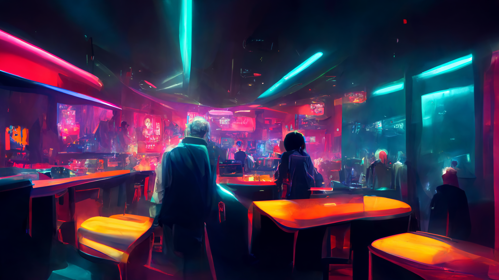

# mAIn world

---

## Lore

Years of hard training passed as you watched the world change. 
World is now controlled by mega corporations that produce robots with advanced combat AI.
Your plan is to put an end to their dominance.

> A journey of a thousand miles begins with a single step.

---

## Controls

<kbd>W</kbd> - jump  
<kbd>D</kbd> - go right  
<kbd>A</kbd> - go left  
<kbd>SPACE</kbd> - katana attack  
<kbd>S</kbd> - emp, deals massive damage, you get only 1 per stage - use it wisely  
<kbd>R</kbd> - restart a stage after death, you get an unlimited amount of attempts  

After clearing a stage from enemies touch the right border to move to the next stage.  

Run the main.py file with Python (version 3) to start the game.

---

## Art

Images, music and dialogues (I wrote dialogues but website generated mp3 files) **were not made by me**.  
Check [credits.txt](./credits.txt) for sources.

---